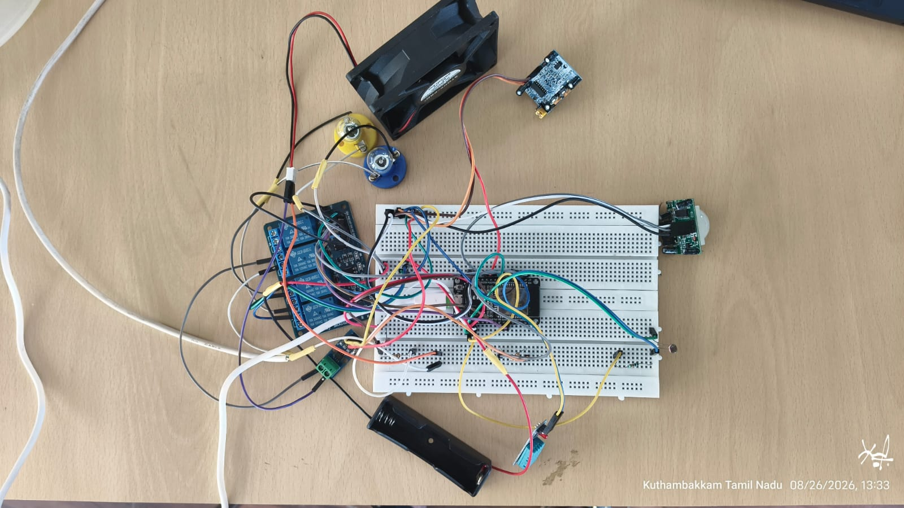
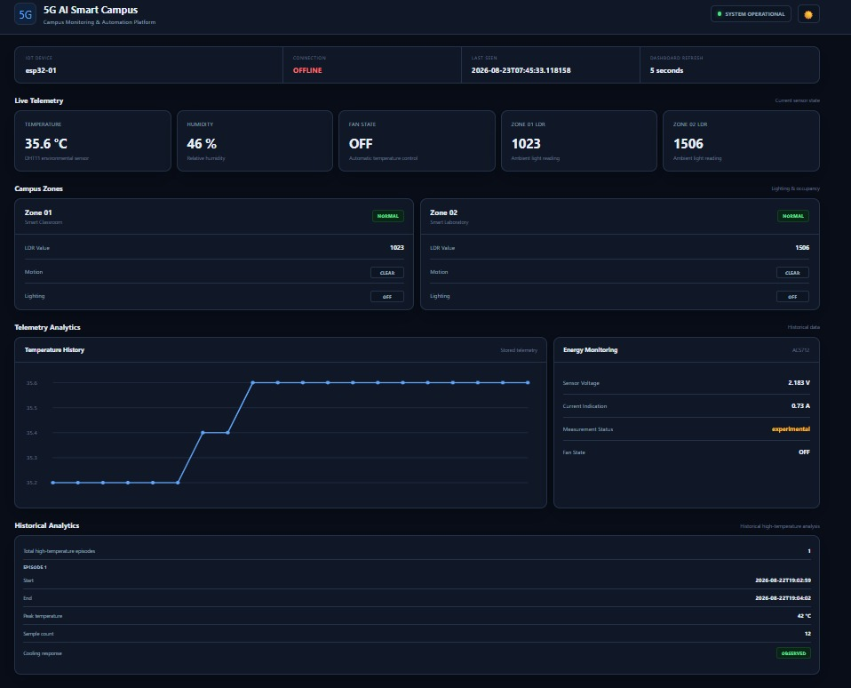
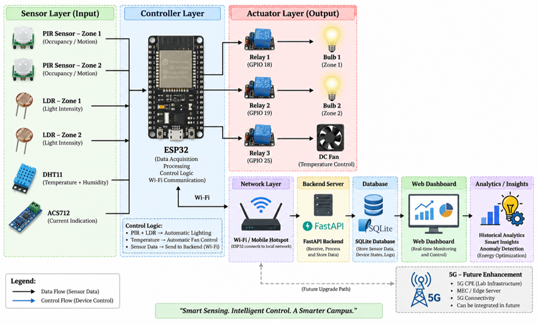

# 5G-AI Smart Campus

An IoT-based Smart Campus Management System with real-time environmental monitoring, automated device control, telemetry analytics, and AI-driven energy optimization.

---

## 📌 Overview

**5G-AI Smart Campus** is an IoT and AI-based smart campus management system developed to monitor campus environments, automate electrical loads, analyze telemetry data, and support intelligent energy-management decisions.

The system uses an **ESP32-based IoT prototype** to collect environmental, lighting, and occupancy-related information. The ESP32 processes sensor inputs and controls electrical loads through a relay module.

The collected telemetry is integrated with a software platform consisting of a backend service, database, web dashboard, historical analytics, and AI-driven optimization.

The overall architecture is designed to support future **5G and edge/MEC integration**.

---

## 📸 Project Demonstration

### 🔧 Hardware Prototype



The physical ESP32-based prototype integrates sensors, relay-controlled loads, and supporting circuitry for Smart Campus automation.

### 📊 Smart Campus Dashboard



The web dashboard provides real-time telemetry, campus-zone status, historical analytics, energy monitoring, anomaly information, and intelligent insights.

### 🏗️ System Architecture



The architecture connects the sensing layer, ESP32 controller, network communication, backend, database, dashboard, analytics, and future 5G/edge-MEC integration.

## 🎯 Objectives

* Monitor campus environmental conditions in real time.
* Detect occupancy using PIR sensors.
* Monitor ambient lighting conditions using LDR sensors.
* Monitor temperature and humidity using a DHT11 sensor.
* Automatically control campus lighting based on environmental and occupancy conditions.
* Automatically control ventilation based on temperature.
* Collect and process IoT telemetry.
* Store and analyze historical telemetry data.
* Provide a centralized web-based monitoring dashboard.
* Apply AI-driven analytics for intelligent energy management.
* Provide an architecture that can be extended to 5G and edge/MEC networks.

---

## ✨ Key Features

* ESP32-based IoT monitoring and control
* Dual-zone intelligent lighting control
* LDR-based ambient light detection
* PIR-based occupancy detection
* Temperature and humidity monitoring
* Automatic temperature-based fan control
* Relay-based electrical load control
* IoT telemetry collection
* Backend API
* Telemetry database
* Real-time monitoring dashboard
* Historical telemetry analytics
* AI-driven analytics and optimization
* Modular architecture for future 5G/MEC integration

---

## 🏗️ System Architecture

```text
                         SMART CAMPUS
                              │
                              ▼
                       ┌─────────────┐
                       │    ESP32    │
                       └──────┬──────┘
                              │
              ┌───────────────┼────────────────┐
              │               │                │
              ▼               ▼                ▼
        LDR Sensors      PIR Sensors         DHT11
              │               │                │
              └───────────────┼────────────────┘
                              │
                              ▼
                       IoT Telemetry
                              │
                              ▼
                           Network
                              │
                              ▼
                       ┌─────────────┐
                       │   FastAPI   │
                       │   Backend   │
                       └──────┬──────┘
                              │
                              ▼
                       ┌─────────────┐
                       │   Database  │
                       └──────┬──────┘
                              │
                    ┌─────────┴─────────┐
                    ▼                   ▼
             ┌─────────────┐     ┌─────────────┐
             │  Dashboard  │     │ AI /        │
             │ & Analytics │     │ Optimization│
             └─────────────┘     └──────┬──────┘
                                        │
                                        ▼
                                  Control Decision
                                        │
                                        ▼
                                     ESP32
                                        │
                                        ▼
                                Relay / Electrical
                                     Loads
```

---

## 🔧 Hardware Components

The physical prototype consists of:

* ESP32 development board
* LDR sensors × 2
* PIR motion sensors × 2
* DHT11 temperature and humidity sensor
* ACS712 current sensor
* Relay module
* Bulbs / lighting loads
* Fan
* Connecting wires and supporting circuitry

---

## ⚙️ Hardware Configuration

### Zone 1

```text
GPIO34 → LDR1
GPIO27 → PIR1
GPIO18 → Relay IN1 → Bulb 1
```

The first lighting zone uses ambient light and occupancy information for automatic control.

**Control Logic:**

```text
Low ambient light + detected motion
              ↓
           Bulb 1 ON
```

Otherwise:

```text
Bulb 1 OFF
```

### Zone 2

```text
GPIO35 → LDR2
GPIO14 → PIR2
GPIO19 → Relay IN2 → Bulb 2
```

The second lighting zone follows the same intelligent lighting principle.

**Control Logic:**

```text
Low ambient light + detected motion
              ↓
           Bulb 2 ON
```

Otherwise:

```text
Bulb 2 OFF
```

### Temperature and Humidity Monitoring

```text
GPIO26 → DHT11 Data
```

The DHT11 provides:

* Temperature
* Humidity

### Automatic Fan Control

```text
GPIO25 → Relay IN3 → Fan
```

The fan is controlled based on temperature conditions.

During hardware testing, the control threshold was configured to approximately:

```text
33°C
```

The system demonstrated temperature-based fan switching during physical testing.

---

## 🔌 Relay Control

The relay module is used to control the electrical loads:

```text
Relay IN1 → Bulb 1
Relay IN2 → Bulb 2
Relay IN3 → Fan
```

The relay logic used in the prototype is active-low:

```text
LOW  → ON
HIGH → OFF
```

---

## ⚡ ACS712 Current Sensor

An **ACS712ELCTR-20A** current sensor was integrated into the prototype for current-sensing experiments.

```text
ACS712
   ↓
Analog Output
   ↓
Voltage Divider
   ↓
ESP32 Analog Input
```

The sensor produces a measurable analog signal and responds to changes in load conditions.

### Measurement Limitation

The ACS712 zero-point and baseline showed variation during testing.

Therefore, accurate absolute current, power, and energy measurements require proper calibration and reference validation.

For this reason, the project does **not** claim laboratory-grade energy measurements or a specific percentage of energy savings based solely on the current ACS712 setup.

---

## 💻 Software Architecture

The software platform follows a modular architecture:

```text
ESP32
  │
  ▼
Network Communication
  │
  ▼
FastAPI Backend
  │
  ▼
Database
  │
  ├───────────────┐
  ▼               ▼
Dashboard       AI / Analytics
                    │
                    ▼
             Optimization Logic
                    │
                    ▼
               Device Control
```

---

## 🖥️ Backend

The backend provides the application layer for handling IoT telemetry and supporting communication between the hardware and the dashboard.

The project uses:

* Python
* FastAPI
* Database persistence
* API-based telemetry handling

The backend is located inside:

```text
backend/app/
```

The backend can be started with the following command from the `backend/` directory:

---

## 📊 Dashboard

The project includes a web-based dashboard for monitoring and analyzing the Smart Campus system.

The dashboard provides visibility into areas such as:

* Temperature
* Humidity
* Ambient light
* Occupancy / motion
* Device status
* Lighting zones
* Fan status
* Telemetry
* Historical analytics
* AI / optimization information

The dashboard provides a centralized interface for understanding the state of the Smart Campus system.

---

## 📈 Historical Analytics

Historical telemetry is stored and analyzed to understand system behavior over time.

The analytics layer can be used to study:

* Environmental trends
* Occupancy patterns
* Device operation
* Telemetry history
* Energy-management conditions

Historical data provides the foundation for intelligent optimization.

---

## 🤖 AI and Intelligent Energy Optimization

The project incorporates AI-driven analytics to support intelligent energy-management decisions.

The general workflow is:

```text
IoT Telemetry
      ↓
Data Processing
      ↓
Analytics / AI
      ↓
Optimization Decision
      ↓
Device Control
```

The objective is to reduce unnecessary operation of campus electrical loads while maintaining suitable environmental and occupancy conditions.

The AI layer is integrated with the overall software architecture so that future improvements can include more advanced prediction, anomaly detection, and adaptive optimization techniques.

---

## 🌐 5G and Edge/MEC Architecture

The project was designed with future 5G and edge computing integration in mind.

The intended future architecture is:

```text
ESP32
  │
  ▼
5G Connectivity
  │
  ▼
5G Network
  │
  ▼
Edge / MEC
  │
  ▼
Backend
  │
  ├──────────────┐
  ▼              ▼
Dashboard       AI
                  │
                  ▼
           Energy Optimization
```

### Current 5G Status

The core Smart Campus prototype, software platform, dashboard, analytics, and intelligent-control components were developed as part of this project.

However, **experimental end-to-end 5G integration was not completed** because the required 5G testbed/network integration could not be validated.

Therefore, this repository does **not** claim that the ESP32-to-5G-to-MEC path has been experimentally demonstrated.

5G and MEC remain an important future extension of the system.

---

## 🧪 Testing and Validation

The physical prototype was tested for:

* ESP32 operation
* LDR sensing
* PIR motion detection
* Automatic lighting control
* DHT11 temperature and humidity sensing
* Temperature-based fan control
* Relay operation
* ACS712 analog signal response

The core local Smart Campus automation was demonstrated using physical hardware.

The software system was developed to integrate telemetry, backend processing, dashboard visualization, historical analytics, and AI-driven optimization.

---

## 🧠 Smart Campus Working Flow

```text
1. Sensors monitor the environment
              ↓
2. ESP32 collects sensor information
              ↓
3. Local automation processes conditions
              ↓
4. Electrical loads are controlled
              ↓
5. Telemetry is sent to the software system
              ↓
6. Backend processes and stores telemetry
              ↓
7. Dashboard displays system information
              ↓
8. Historical analytics identify patterns
              ↓
9. AI provides intelligent optimization
              ↓
10. Optimization decisions support efficient
    Smart Campus operation
```

---

## 📁 Project Structure

```text
5G-AI-Smart-Campus/
│
├── backend/
│   └── app/
│
├── .gitignore
├── hello.py
├── requirements.txt
└── README.md
```

---

## 🛠️ Technologies Used

### Hardware

* ESP32
* LDR
* PIR
* DHT11
* ACS712
* Relay Module
* Bulbs
* Fan

### Embedded Development

* Arduino IDE
* ESP32 firmware
* C/C++ based embedded programming

### Backend

* Python
* FastAPI
* Database

### Frontend

* HTML
* CSS
* JavaScript
* Web dashboard

### Intelligence

* Data analytics
* AI-driven optimization

### Future Networking

* 5G
* Edge Computing
* MEC

---

## 🚀 Getting Started

### Prerequisites

Make sure the following are available:

* Python 3.x
* Arduino IDE
* ESP32 board support
* ESP32 development board
* Required hardware components

### Clone the Repository

```bash
git clone https://github.com/Yash-5413/5G-AI-Smart-Campus.git
cd 5G-AI-Smart-Campus
```

### Install Python Dependencies

```bash
pip install -r requirements.txt
```

### Backend

The backend application is located inside:

```text
backend/app/
```

Use the FastAPI application and configuration provided in the repository to start the backend service.

To start the backend:

```
bash
cd backend
uvicorn app.main:app --reload

---

## 📌 Project Status

| Component                   | Status                              |
| --------------------------- | ----------------------------------- |
| Project concept             | ✅ Completed                         |
| System architecture         | ✅ Completed                         |
| ESP32 prototype             | ✅ Completed                         |
| LDR sensing                 | ✅ Completed                         |
| PIR sensing                 | ✅ Completed                         |
| DHT11 monitoring            | ✅ Completed                         |
| Automatic lighting          | ✅ Completed                         |
| Automatic fan control       | ✅ Completed                         |
| Relay control               | ✅ Completed                         |
| ACS712 integration          | ✅ Completed for sensing experiments |
| Accurate energy calibration | ⚠️ Requires further validation      |
| Backend                     | ✅ Completed                         |
| Database / telemetry        | ✅ Completed                         |
| Dashboard                   | ✅ Completed                         |
| Historical analytics        | ✅ Completed                         |
| AI / analytics              | ✅ Completed                         |
| Intelligent optimization    | ✅ Completed                         |
| 5G experimental integration | ❌ Not completed                     |
| 5G/MEC future integration   | 🔄 Future scope                     |

---

## 🔮 Future Scope

The system can be extended in several directions:

* Complete experimental 5G integration.
* Integrate an edge/MEC computing environment.
* Improve current and energy measurement accuracy.
* Deploy the system across multiple campus buildings.
* Add more environmental and occupancy sensors.
* Improve AI-based energy forecasting.
* Implement advanced anomaly detection.
* Introduce adaptive load scheduling.
* Evaluate latency and reliability under 5G networks.
* Integrate additional smart-campus services.
* Develop a scalable multi-building IoT architecture.

---

## 👥 Team Members

This project was developed as a collaborative five-member team project.

| S. No. | Team Member      |
| -----: | ---------------- |
|      1 | **Yaswanth H**   |
|      2 | **Hariharan R**  |
|      3 | **Yogeswaran K** |
|      4 | **Mohith M**     |
|      5 | **Vignesh S.H**  |

---

## 🎓 Project Domain

* **Internet of Things (IoT)**
* **Embedded Systems**
* **Artificial Intelligence**
* **Smart Energy Management**
* **Smart Campus Automation**
* **Wireless Communication**
* **5G / Edge Computing Architecture**

---

## 📜 Academic Project

This project was developed as an academic engineering project to demonstrate the integration of IoT, embedded systems, software engineering, data analytics, and AI-driven intelligent automation for Smart Campus applications.

---

## 📄 License

This project is developed for academic and educational purposes.
